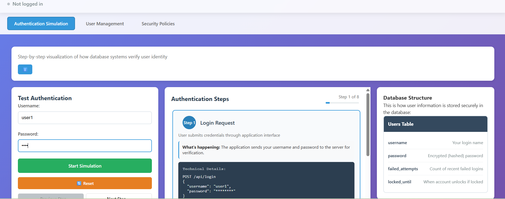
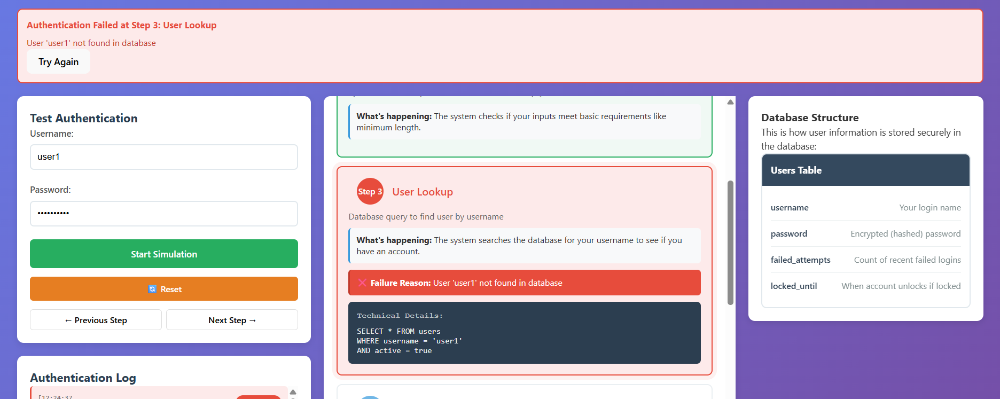
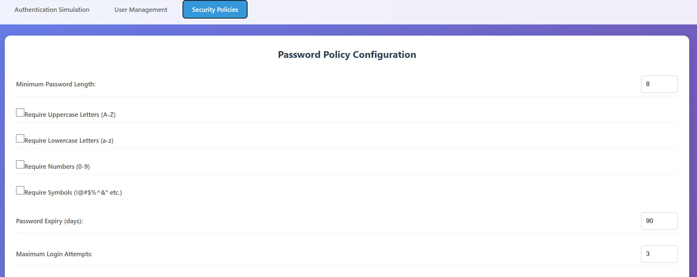
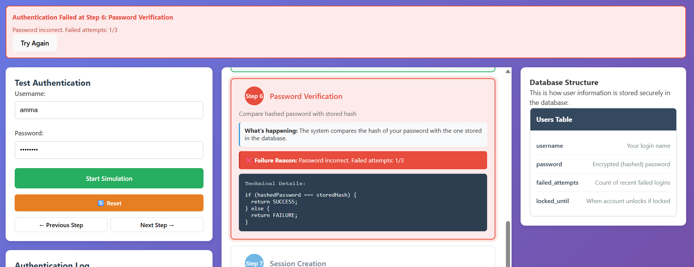
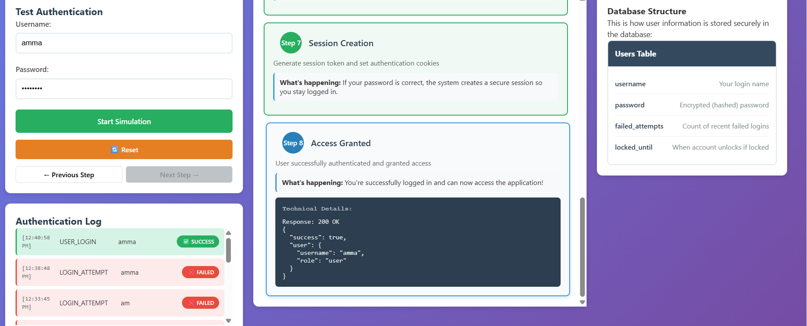

**Step 1: Initial Login Attempt (Invalid User)**  
Enter `user1` in the Username field and any password in the Test Authentication panel, then click **Start Simulation**.

  
&nbsp;

**Step 2: User Creation**  
Navigate to the **User Management** tab, enter a username (e.g., `ammauser`), select **Role**, set a compliant password, and click **Create User Account**.

  
&nbsp;

**Step 3: Configure Security Policies**  
Go to the **Security Policies** tab and set constraints such as minimum password length, character requirements, and maximum login attempts.

  
&nbsp;

**Step 4: Successful Login with Valid Credentials**  
Return to the **Authentication Simulation** tab, enter the created username and correct password, then click **Start Simulation**.

  
&nbsp;

**Step 5: Observe Password Verification**  
Step 6 in the simulation highlights **Password Verification**, where the system compares the hashed input with the stored hash.

  
&nbsp;

**Step 6: Session Creation & Access Granted**  
Upon successful verification, Step 7 creates a session token and Step 8 returns a **200 OK** response, with a **SUCCESS** badge in the Authentication Log.

  
&nbsp;
