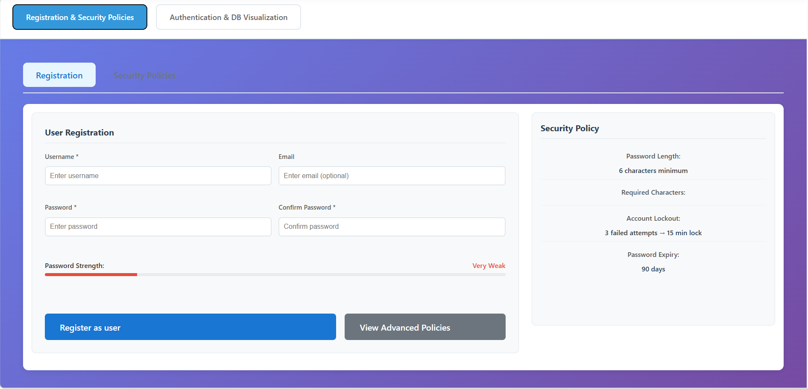
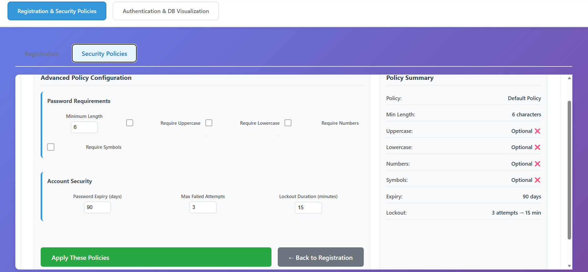
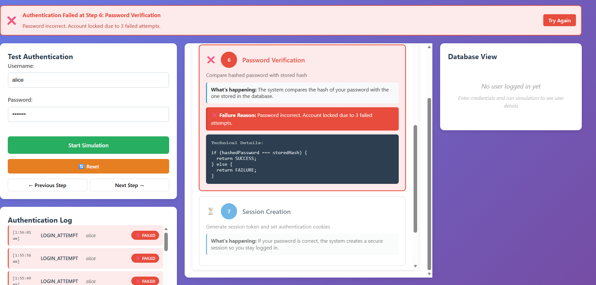
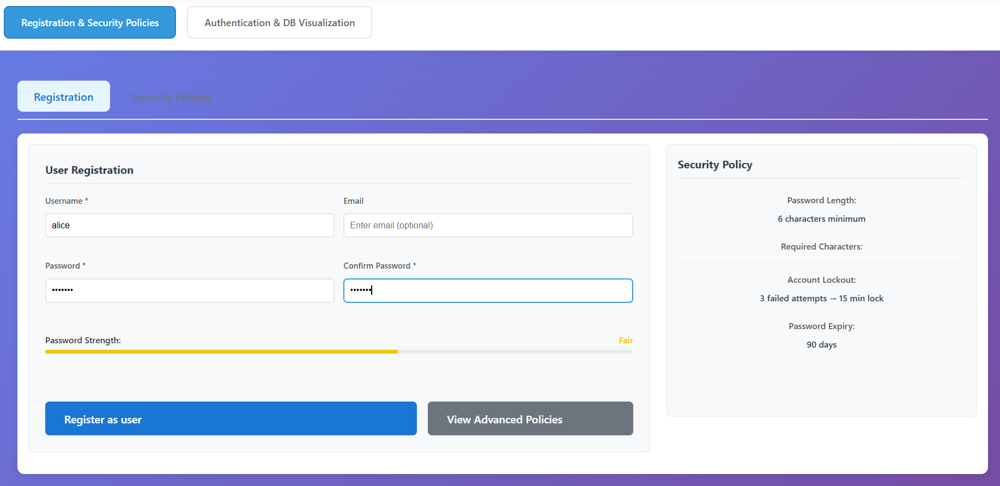
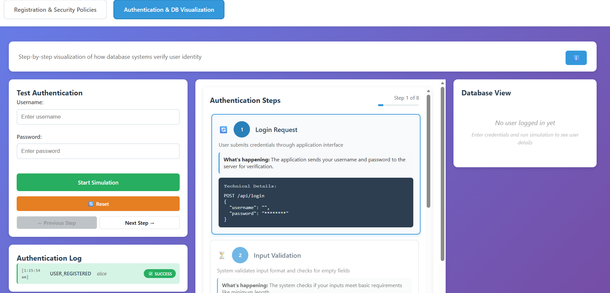
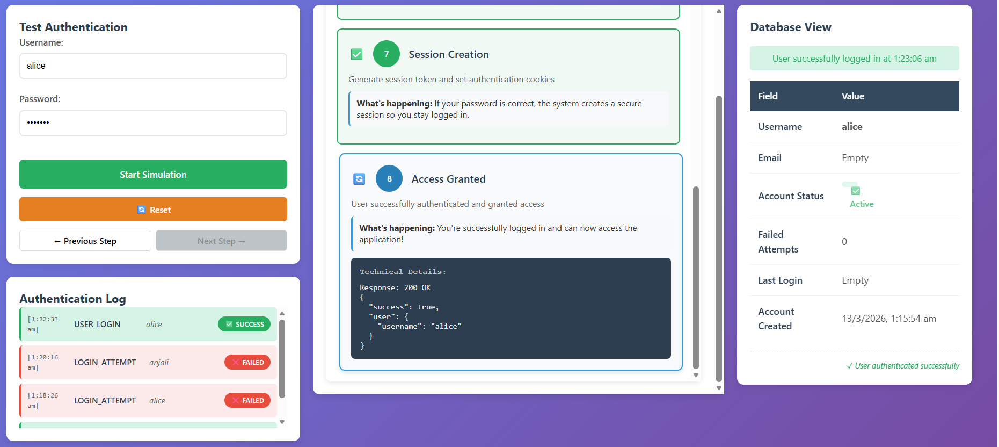
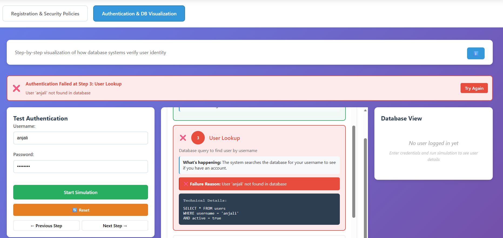
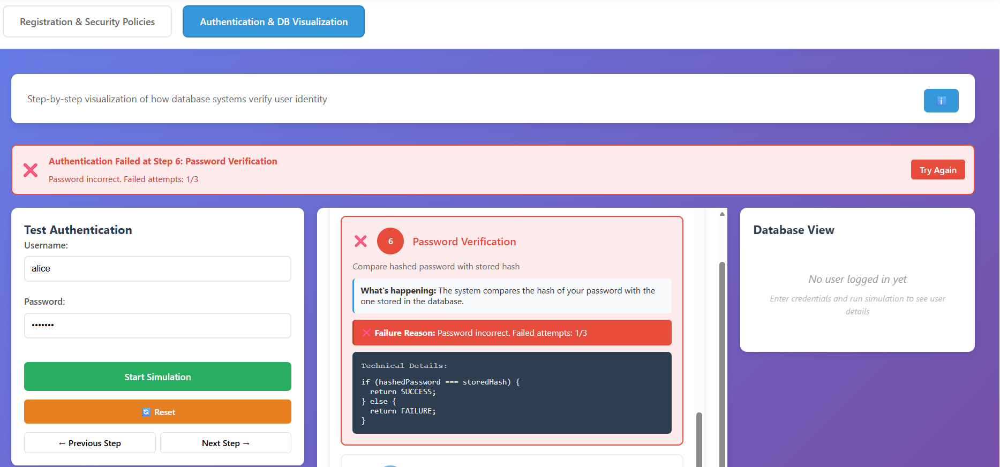

<h2>Registration & Security Policies</h2>

<h3>Configure Security Policies</h3>

1. Navigate to the **Registration & Security Policies** tab.

2. Click View Advanced Policies to see the detailed configuration.

3. Set minimum password length, required characters (uppercase, numbers, etc.), and account lockout rules (e.g., 3 attempts) then on Click Apply These Policies to update the system rules.

<h3>Register a New User</h3>

- Return to the **Registration** sub-tab.
- **Username**: Enter a unique name for your account.
- **Email**: Provide an optional email address.
- **Password**: Type a password while monitoring the **Password Strength** meter. It must match the current security policies.
- **Verification**: Re-type the password in the **Confirm Password** field.
- Click **Register as user**. You will see a success message if the inputs are valid.

<h2>Authentication & DB Visualization</h2>

<h3>Start the Authentication Simulation and Observe the Verification Steps</h3>

- Switch to the **Authentication & DB Visualization** tab.

<!-- - In the **Test Authentication** panel, enter the username and password you just created.
- Click **Start Simulation**. -->

1.  **Login Request**: User credentials are submitted to the server.
2.  **Input Validation**: The system checks for empty fields or invalid formats.
3.  **User Lookup**: A database query (`SELECT`) is run to find the user.
4.  **Status Check**: Verifies if the account is active or locked.
5.  **Password Hashing**: The entered plaintext password is hashed (SHA-256).
6.  **Password Verification**: The new hash is compared against the stored hash.
7.  **Session Creation**: On success, a secure session token is generated.
8.  **Access Granted**: The user is redirected to the dashboard.

- **Successful Login**: Enter the correct credentials for your registered user and observe the access being granted.

<h3>Test Failure Scenarios</h3>

- **Non-Existent User**: Enter a username that hasn't been registered. Observe the failure at **Step 3 (User Lookup)**.

- **Incorrect Password**: Use a valid username but the wrong password. Observe the failure at **Step 6 (Password Verification)** and note the **Failed Attempts** counter increasing in the logs.

- **Account locked**: Repeat incorrect logins until the maximum attempts are reached (e.g., 3). Verify that the account status changes to **Locked**.

